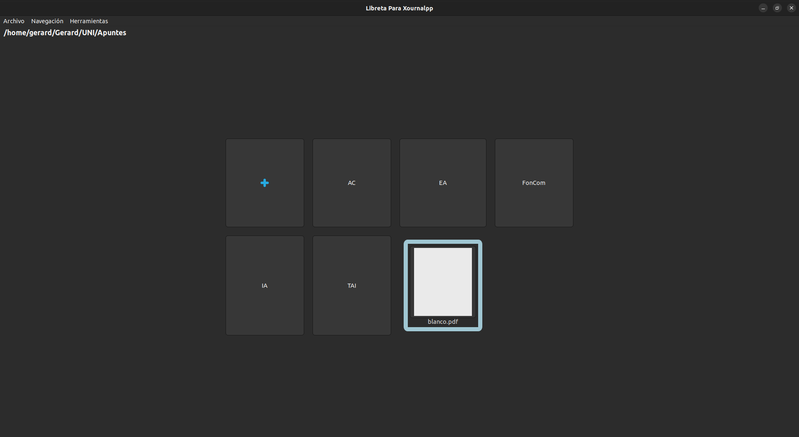
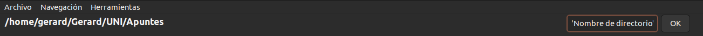
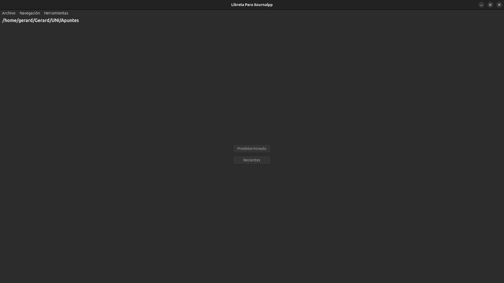

# Graphic Notebook for Xournal++

## Introduction

This application has been developed in C using the GTK3+ graphics library. It displays `.xopp` and `.pdf` files in a grid with 4 columns and an unlimited number of rows.

I started developing this application because I take my university notes with Xournal++. What I found missing was an application that organizes all my notes, similar to iPad applications like GoodNotes or Microsoft's OneNote. I didn’t like having to open my file manager to search for my notes.

## Description

### General

This application serves as a file management interface that displays folders and files in a grid layout. Each button represents a file or folder, and clicking on it either opens the file in Xournal++ or navigates into the folder. PDF files are marked with a blue frame and can be opened directly, while XOPP files are marked with an orange frame (not visible in the current image).

The interface is scrollable both horizontally and vertically, allowing users to navigate through contents that exceed the screen size. In addition, the files include a **preview** function, enabling users to see a thumbnail or a glimpse of the file's content. This is particularly useful for quickly locating specific files when dealing with many documents. The current directory path is always visible at the top.

Right-clicking on a folder presents a "Remove" option, allowing you to delete the folder. If you right-click on a file, depending on its type, the options change:

-**PDF**: You’ll see an option to open the file with the default application.

-**XOPP**: You’ll see an option to export the file to PDF.

### Menu

The menu consists of three submenus:

- **Archivo**:

   - *New folder*: Create a new folder by specifying a name in the designated input field.

   - *Export to PDF*: Allows you to export a XOPP file to PDF by clicking on it. This is similar to the right-click option on XOPP files.

   - *Reset*: Hides and resets the folder creation input section.

   - *Remove recents*: Clears the recently accessed files from the main screen.

- **Navegación**:

  - *Mostrar PDFs?*: If selected, PDF files will appear in the grid.

  - *Mostrar previsualizaciones?*: If selected, previews for both PDF and XOPP files will be shown.

  - *Cambiar ruta predeterminada*: Allows you to change the application's default start path by filling in the input field.

  - *Ordenar*:

    -*Xopp primero*: (Default) Displays XOPP files first.

    -*PDF primero*: Displays PDF files first.

  - *Refrescar directorio*: Reloads and refreshes the current directory, updating the content.

   - *Volver a inicio*: Returns to the initial screen.

- **Herramientas**: The most important option here is to remove the cache files, which can be done by selecting the "Remove cache" option. Cache files are stored in `~/.libretaXournal`.

### Initial screen

On the initial screen, there are two buttons:

- *Predeterminado*: This button takes you to the main function of the application, displaying directories and files.

- *Recientes*: This button takes you to the list of recently opened files, loading their information from a file.

## Installation
